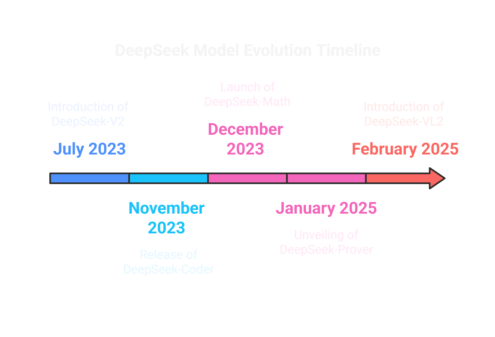
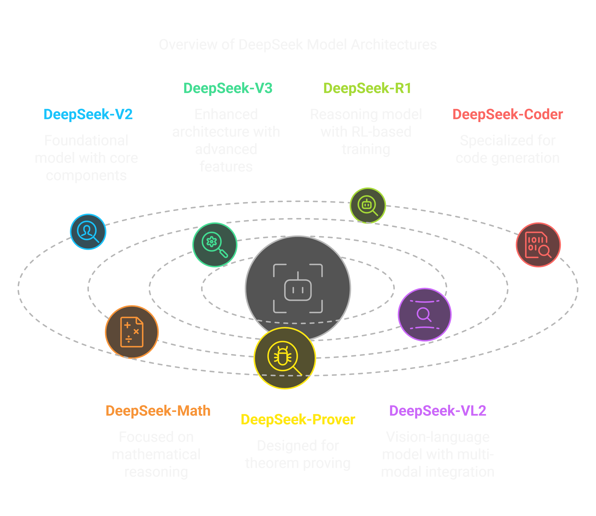

# 🧠 DeepSeek AI Models Research Repository

<div align="center">
  <a href="https://huggingface.co/collections/deepseek-ai/deepseek-r1-678e1e131c0169c0bc89728d" target="_blank">
    
  </a>
  <a href="https://huggingface.co/deepseek-ai" target="_blank">
    
  </a>
</div>

<div align="center">
  <p>🔍 Research repository exploring DeepSeek AI's model evolution and architectures (2023-2025). Analyzes language, code, math, and vision models using HuggingFace collections. 📚 A personal learning journey into understanding these advanced AI systems.</p>
</div>

<p align="center">
  <a href="#model-categories"><b>📚 Models</b></a> |
  <a href="#repository-structure"><b>📂 Structure</b></a> |
  <a href="#research-methodology"><b>🔍 Methodology</b></a> |
  <a href="#technical-analyses"><b>⚡ Analyses</b></a>
</p>

## 📚 Model Evolution

<div align="center" style="padding: 1em;">
  
</div>

The timeline above illustrates the evolution of DeepSeek's model families, from the initial V2 to specialized variants in code, math, and vision domains.


## 📖 Repository Purpose

This repository serves as a centralized knowledge base for understanding DeepSeek AI's contributions to artificial intelligence. Through careful analysis of public documentation, research papers, and technical discussions, it provides detailed insights into DeepSeek's model architectures, training methodologies, and capabilities.

## 🔍 Research Methodology

The research process utilizes several authoritative sources:
- DeepSeek's official [Hugging Face collections](https://huggingface.co/collections/deepseek-ai/deepseek-r1-678e1e131c0169c0bc89728d)
- Technical documentation and research papers
- Community discussions and model analyses
- Systematic examination using AI research tools (Google's Gemini)

[Research Process Flowchart - To be added]
> Detailed visualization of the research and documentation methodology

## 📚 Model Categories

### Language Models (LLMs)

The DeepSeek-LLM family represents their text-based language models, characterized by:
- Transformer-based architectures
- Large-scale parameter counts
- Efficiency-focused design

#### Core Models:
- **DeepSeek-V2**
  - 236B parameters (21B active per token)
  - MoE architecture with MLA and GQA
  - 8.1T training tokens
  
- **DeepSeek-V3**
  - 671B parameters (37B active per token)
  - Advanced MoE with auxiliary-loss-free balancing
  - 14.8T training tokens
  - 128K context length
  
- **DeepSeek-R1**
  - Reasoning-focused enhancement
  - RL-based training approach
  - Comparable to OpenAI-o1 in specific domains

## Model Architecture Diagram

<div style="padding: 1em; text-align: center;">
  
</div>

### Specialized Models

#### Code Generation
- **DeepSeek-Coder (First Gen)**
  - Variants: 1.3B, 6.7B, 33B parameters
  - Focused on code completion and generation
  
- **DeepSeekCoder-V2**
  - Built on V2 architecture
  - 2T code-specific training tokens
  - Base and Instruct versions available

#### Mathematical Models
- **DeepSeek-Math**
  - Competition-level problem solving
  - 7B parameter variants
  
- **DeepSeek-Prover**
  - Formal theorem proving in Lean 4
  - Multiple variants with RL enhancements

#### Vision-Language Models
- **DeepSeek-VL and VL2**
  - Multimodal understanding capabilities
  - Progressive improvements in vision-language tasks
  - MoE architecture in VL2

<!-- [Model Capabilities Matrix - To be added]
> Comparative visualization of model capabilities across different domains -->

## 📂 Repository Structure

The repository contains detailed markdown files for each model and architecture:

### Core Documentation
```
DeepSeek-LLM.md        - Family overview and relationships
DeepSeek-V2.md         - Base architecture analysis
DeepSeek-V3.md         - Advanced architecture study
DeepSeek-R1.md         - Reasoning capabilities exploration
```

### Specialized Documentation
```
DeepSeek-Coder.md      - Code generation analysis
DeepSeekCoder-V2.md    - Advanced code model study
DeepSeek-Math.md       - Mathematical capabilities
DeepSeek-Prover.md     - Theorem proving analysis
DeepSeek-VL.md         - Vision-language integration
DeepSeek-VL2.md        - Advanced multimodal study
```

### Technical Documentation
```
DeepSeek-MoE.md        - Mixture of Experts deep dive
ESFT.md                - Training methodology analysis
```

## 🔑 Key Technical Features

### Mixture-of-Experts (MoE)
A cornerstone architecture enabling efficient scaling:
- Large parameter counts with selective activation
- Efficient inference and training
- Implementation across multiple model generations

### Training Techniques
Notable methodologies including:
- Efficient Supervised Fine-Tuning (ESFT)
- Reinforcement Learning approaches
- FP8 mixed precision training

[Technical Architecture Diagram - To be added]
> Detailed visualization of key technical components

## 🎯 Research Focus Areas

Current areas of investigation include:
- Parameter efficiency in large models
- Scaling strategies and trade-offs
- Specialized model development
- Multi-modal integration approaches

## ⚠️ Important Notes

- This repository represents independent research based on public information
- "DeepSeek-LLM" refers to the entire family of language models
- "DeepSeek-V2.5" is not an official model designation
- All models maintain an open-access approach on Hugging Face

## 🔗 Essential Resources

- [DeepSeek AI on Hugging Face](https://huggingface.co/deepseek-ai)
- [Model Documentation](https://huggingface.co/docs)
- [Research Papers and Technical Reports](https://huggingface.co/papers)

## 🤝 Research Community

This repository welcomes:
- Technical discussions through issues
- Documentation improvements
- Additional research insights
- Collaborative learning opportunities

## Research Ethics

All documentation maintains:
- Proper attribution of sources
- Ethical research practices
- Intellectual property respect
- Technical accuracy

---

*This repository represents independent research and documentation efforts, unaffiliated with DeepSeek AI. All information derives from public sources and respects intellectual property rights.*